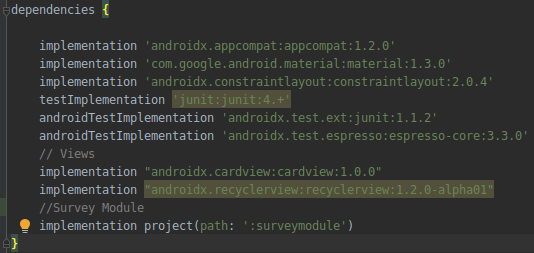

# Welcome to the SurveyModule implementation

***SurveyModule is a module that allows you to apply surveys. This module returns the JSON of the survey with your responses.***

## Minimum SDK Version

    Minimum version 16 (Android 4.1 - Jelly Bean)

## Features
- The answer of a certain question (RadioGroup, Checkbox, Select) can display a set of questions.
- The answer of a certain question (RadioGroup, Checkbox, Select) can hide a set of questions.
- The answer to a certain question can show a set of answers to another question.
- The answer to a certain question can end the survey.
- The questionnaire is concluded until the mandatory questions are answered.
- If you return to a questionnaire, the previous data is loaded.
-The survey is updated if the value of the versionCode attribute changes.

## Download this project

    git clone https://gitlab.com/racf/survey-module-impl-android.git

## Import to a project
1. From the menu bar, click **File** -> **Import module...**
2. Navigate to the **surveymoduleimplandroid**
3. Select the **surveymodule** and click **Finish**
4. From the menu bar, click **File** -> **Project Structure...**
5. Select the menu **Dependencies**
6. Select the **app** folder
7. Click on the **add dependency** button (+)
8. Click the menu **module dependency**
9. Select the module **surveymodule** and click **Ok**
10. Click **Apply** and click **Ok**

The image shows the **surveymodule** in the project dependencies:

## Implementation in a project

## Component types
1. **Text** : This type of component allows capturing different types of text in an input. The supported input types are the following:

    - phone
    - textPersonName
    - number
    - text

2. **RadioGroup** : This type of component allows you to select a single answer from a group of answers.
3. **Checkbox** : This type of component allows you to select one or more answers from a group of answers.
4. **Select** : This type of component allows you to select a single option from a list of options.

## **Join us to improve SurveyModule!** :page_with_curl:

## License
    Apache 2.0